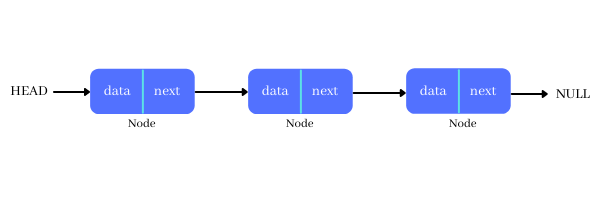

# Linked List 
A linked list is a collection of data elements called nodes in which the linear representation is given by links from one node to another.
In simple terms linked list is linear collection of data elements. These data elements are called _**nodes**_.
It can be perceived as a train, or a sequence of nodes in which each node contains one or more data fields and pointer to the next node.

Operations on linked list: Traverse, insert, delete

### Types of Linked list:
* Single Linked List
* Doubly Linked List
* Circular Linked List

